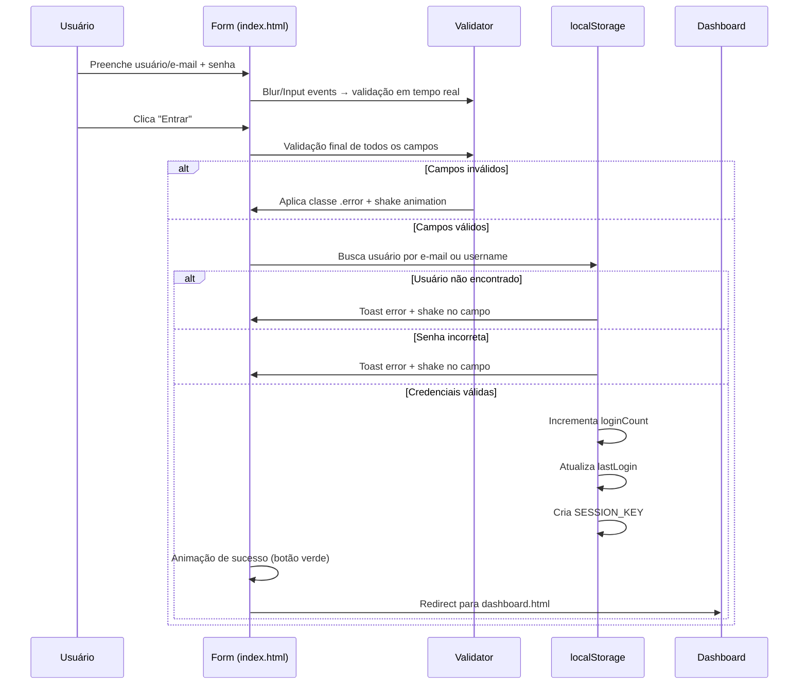
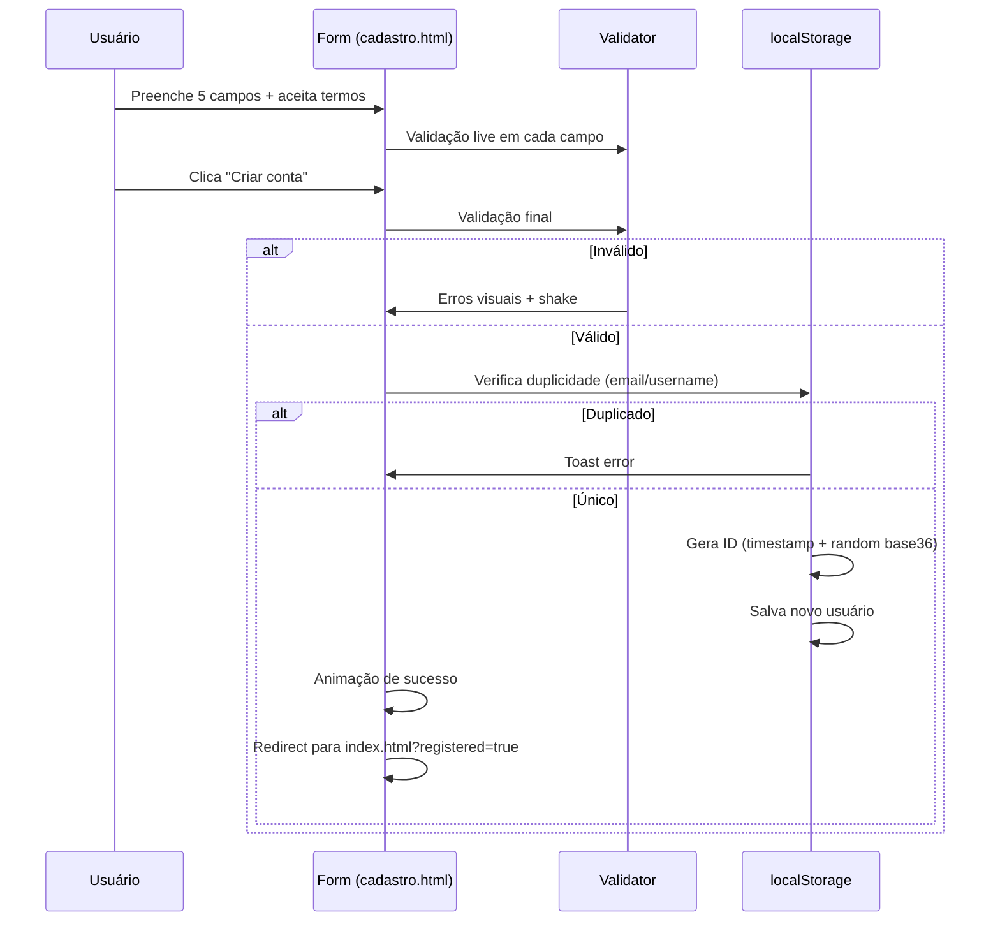

# 🔐 Tela de Login Moderna

> Sistema de Autenticação Web com Interface Moderna, Glassmorphism e Experiência de Usuário Premium

<p align="center">
  
</p>

<p align="center">
  <a href="#-tecnologias"></a>
  <a href="#-tecnologias"></a>
  <a href="#-tecnologias"></a>
  <a href="#-arquitetura"></a>
  <a href="#-licença"></a>
</p>

---

## 📑 Sumário

- [Visão Geral](#-visão-geral)
- [Funcionalidades](#-funcionalidades)
- [Tecnologias](#-tecnologias)
- [Arquitetura](#-arquitetura)
- [Estrutura de Diretórios](#-estrutura-de-diretórios)
- [Fluxos de Autenticação](#-fluxos-de-autenticação)
- [Design System](#-design-system)
- [API de Armazenamento](#-api-de-armazenamento)
- [Componentes](#-componentes)
- [Responsividade](#-responsividade)
- [Performance](#-performance)
- [Segurança](#-segurança)
- [Roadmap](#-roadmap)
- [Instalação](#-instalação)
- [Licença](#-licença)

---

## 🎯 Visão Geral

O **Premium Auth System** é uma aplicação front-end de autenticação completa, construída com HTML5 semântico, CSS3 moderno e JavaScript vanilla. O sistema implementa um fluxo de autenticação de ponta a ponta — desde o cadastro de usuários até o painel administrativo pós-login — com ênfase em **experiência de usuário (UX)**, **design visual coeso** e **micro-interações fluidas**.

A arquitetura adota o padrão **SPA-like** (Single Page Application feel) através de múltiplas páginas HTML interconectadas, compartilhando um único sistema de estilos e scripts, com estado gerenciado via `localStorage` do navegador.

### Destaques Técnicos

- 🎨 **Glassmorphism Design** — Cards com `backdrop-filter: blur(20px)`, bordas semi-transparentes e profundidade visual
- ✨ **Animações CSS Avançadas** — 8+ keyframes customizados com `cubic-bezier` easing de precisão
- 🔒 **Validação em Tempo Real** — Feedback instantâneo com estados visuais (erro/sucesso) em todos os formulários
- 📱 **Mobile-First Responsivo** — Sidebar adaptativa com drawer pattern, grid fluido e breakpoints otimizados
- ⚡ **Zero Dependências** — 100% Vanilla JS, sem frameworks ou bibliotecas externas
- 🌐 **OAuth 2.0 Ready** — Integração preparada para Google, Apple, Facebook e Microsoft

---

## ✨ Funcionalidades

### Autenticação

| Funcionalidade | Descrição | Status |
|:--|:--|:--:|
| **Login** | Autenticação por e-mail ou nome de usuário | ✅ |
| **Cadastro** | Registro com validação de campos e verificação de duplicidade | ✅ |
| **Recuperação de Senha** | Wizard de 3 etapas com código de verificação simulado | ✅ |
| **Lembrar de Mim** | Persistência do identificador no localStorage | ✅ |
| **Logout** | Encerramento de sessão com modal de confirmação | ✅ |
| **Proteção de Rotas** | Redirecionamento automático baseado em estado de sessão | ✅ |

### Dashboard

| Funcionalidade | Descrição | Status |
|:--|:--|:--:|
| **Visão Geral da Conta** | Cards com estatísticas e informações do usuário | ✅ |
| **Sidebar Navegacional** | Menu fixo com avatar, links e logout | ✅ |
| **Saudação Dinâmica** | Mensagem baseada no horário do dia (Bom dia/Tarde/Noite) | ✅ |
| **Atividade Recente** | Timeline com eventos de login e criação de conta | ✅ |
| **Status de Segurança** | Indicadores visuais de senha, 2FA e sessões | ✅ |
| **Notificações** | Badge animado com contador de alertas | ✅ |

### UX/UI

| Funcionalidade | Descrição | Status |
|:--|:--|:--:|
| **Toggle de Senha** | Mostrar/ocultar senha com ícones SVG animados | ✅ |
| **Medidor de Força** | Barra progressiva de 5 níveis com cores dinâmicas | ✅ |
| **Code Inputs** | 6 campos de dígito com navegação por teclado e paste | ✅ |
| **Toast Notifications** | Alertas flutuantes com 3 tipos (success/error/info) | ✅ |
| **Loading States** | Spinners e transições em todos os botões de ação | ✅ |
| **Shake Animation** | Feedback tátil de erro nos campos inválidos | ✅ |
| **Reduced Motion** | Respeito à preferência `prefers-reduced-motion` | ✅ |

---

## 🛠 Tecnologias

### Core Stack

```
HTML5        — Estrutura semântica, formulários com validação nativa (novalidate)
CSS3         — Custom Properties, Flexbox, CSS Grid, Backdrop Filter, Keyframes
JavaScript   — ES6+, DOM API, Event Delegation, localStorage API
```

### Recursos Externos

| Recurso | Uso | URL |
|:--|:--|:--|
| **Google Fonts** | Tipografia Poppins (300-700) | `fonts.googleapis.com` |
| **OAuth Google** | Login social (placeholder) | `accounts.google.com` |
| **OAuth Apple** | Login social (placeholder) | `appleid.apple.com` |
| **OAuth Facebook** | Login social (placeholder) | `facebook.com/dialog/oauth` |
| **OAuth Microsoft** | Login social (placeholder) | `login.microsoftonline.com` |

### Assets Estáticos

```
img/
├── favicon.png    — Ícone do navegador (16x16/32x32)
└── login.png      — Logo principal da aplicação
```

---

## 🏗 Arquitetura

### Padrão de Estado

O sistema utiliza uma arquitetura **State-in-DOM** com persistência em `localStorage`. Não há framework de estado (Redux, Vuex, etc.) — o gerenciamento é feito via funções utilitárias puras que leem/escrevem no storage do navegador.

```
┌─────────────────────────────────────────┐
│              View Layer                 │
│  ┌─────────┐ ┌──────────┐ ┌─────────┐  │
│  │ index   │ │ cadastro │ │dashboard│  │
│  │.html    │ │ .html    │ │ .html   │  │
│  └────┬────┘ └────┬─────┘ └────┬────┘  │
│       │           │            │        │
│  ┌────┴───────────┴────────────┴────┐   │
│  │        script.js (Controller)     │   │
│  │  • Validação  • localStorage API  │   │
│  │  • Animações  • DOM Manipulation  │   │
│  └───────────────────────────────────┘   │
│                   │                      │
│  ┌────────────────┴─────────────────┐   │
│  │         style.css (Presentation)   │   │
│  │  • Design System  • Animações    │   │
│  │  • Responsividade • Componentes   │   │
│  └───────────────────────────────────┘   │
└─────────────────────────────────────────┘
```

### Fluxo de Dados

```
User Input → Event Listener → Validation → localStorage Write → UI Update
                ↓                                              ↓
         DOM Query/Update                               State Rehydration
```

---

## 📁 Estrutura de Diretórios

```
TELA-LOGIN-ATUALIZADA/
│
├── 📄 index.html              # Tela de Login (entrypoint)
├── 📄 cadastro.html           # Tela de Cadastro de Usuários
├── 📄 recuperar.html          # Wizard de Recuperação de Senha
├── 📄 dashboard.html          # Painel Principal Pós-Login
├── 📄 README.md               # Documentação Técnica
│
├── 📁 css/
│   └── 🎨 style.css           # Folha de estilos unificada (1.800+ linhas)
│                              #   • Reset & Base
│                              #   • Animações CSS
│                              #   • Componentes UI
│                              #   • Layout Dashboard
│                              #   • Responsividade
│
├── 📁 js/
│   └── ⚡ script.js           # Lógica da aplicação (900+ linhas)
│                              #   • Utilitários (toast, loading, shake)
│                              #   • localStorage API (CRUD de usuários)
│                              #   • Validação de formulários
│                              #   • Fluxo de Login
│                              #   • Fluxo de Cadastro
│                              #   • Fluxo de Recuperação
│                              #   • Dashboard & Logout
│
└── 📁 img/
    ├── 🖼️ favicon.png         # Ícone da aplicação
    └── 🖼️ login.png           # Logo principal
```

---

## 🔐 Fluxos de Autenticação

### 1. Login



### 2. Cadastro



### 3. Recuperação de Senha (3 Etapas)

```
┌─────────────┐     ┌─────────────┐     ┌─────────────┐
│   Etapa 1   │ ──► │   Etapa 2   │ ──► │   Etapa 3   │
│  E-mail     │     │   Código    │     │ Nova Senha  │
│             │     │  (6 dígitos)│     │             │
└─────────────┘     └─────────────┘     └─────────────┘
      │                   │                   │
      ▼                   ▼                   ▼
  Valida e-mail      Gera código         Atualiza senha
  na base            aleatório 6d        no localStorage
  Simula envio       Timer 60s           Redirect login
  (console/toast)    Navegação por       ?reset=true
                     teclado + paste
```

### 4. Logout

```
Usuário clica "Sair" → Modal de confirmação → Confirma →
  clearSession() → Toast "Até logo!" →
  Redirect index.html?logout=true
```

---

## 🎨 Design System

### Paleta de Cores

| Token | Valor HEX | Uso |
|:--|:--|:--|
| `--primary` | `#6366f1` | Botões, focos, gradientes (indigo) |
| `--primary-hover` | `#4f46e5` | Hover states |
| `--primary-glow` | `rgba(99, 102, 241, 0.4)` | Sombras de foco |
| `--secondary` | `#ec4899` | Gradientes, acentos (pink) |
| `--bg-dark` | `#0f0f23` | Fundo principal |
| `--bg-card` | `rgba(255,255,255,0.03)` | Cards com glassmorphism |
| `--border-glass` | `rgba(255,255,255,0.08)` | Bordas sutis |
| `--text-main` | `#f1f5f9` | Texto principal (slate-100) |
| `--text-muted` | `#94a3b8` | Texto secundário (slate-400) |
| `--text-label` | `#cbd5e1` | Labels de formulário |
| `--error` | `#ef4444` | Estados de erro (red-500) |
| `--success` | `#22c55e` | Estados de sucesso (green-500) |
| `--warning` | `#f59e0b` | Alertas (amber-500) |
| `--danger` | `#dc2626` | Ações destrutivas (red-600) |

### Tipografia

```css
font-family: 'Poppins', sans-serif;

/* Escala */
--fs-h2:     1.75rem  (28px)  — Títulos de página
--fs-h3:     1.5rem   (24px)  — Subtítulos
--fs-h4:     1.0625rem (17px) — Headers de card
--fs-body:   0.9375rem (15px) — Texto principal
--fs-small:  0.875rem  (14px)  — Descrições
--fs-xs:     0.8125rem (13px)  — Labels, links
--fs-micro:  0.75rem   (12px)  — Badges, timestamps
```

### Sombras

```css
--shadow-3d:  0 25px 50px -12px rgba(0, 0, 0, 0.5);
--shadow-glow: 0 0 40px rgba(99, 102, 241, 0.15);
```

### Raios de Borda

```css
--radius:    20px  — Cards principais
--radius-sm: 12px  — Inputs, botões, badges
```

### Animações

| Nome | Duração | Easing | Uso |
|:--|:--|:--|:--|
| `fadeInUp` | 0.7s | `cubic-bezier(0.16, 1, 0.3, 1)` | Entrada de cards |
| `fadeInLeft` | 0.6s | `cubic-bezier(0.16, 1, 0.3, 1)` | Sidebar, atividades |
| `scaleIn` | 0.5s | `cubic-bezier(0.16, 1, 0.3, 1)` | Modais |
| `slideInBlur` | 0.8s | `cubic-bezier(0.16, 1, 0.3, 1)` | Elementos com blur |
| `floatOrb` | 20s | `ease-in-out` (infinito) | Orbs de fundo |
| `pulseGlow` | 2s | `ease-in-out` (infinito) | Badges, dots |
| `shake` | 0.4s | `ease-in-out` | Erros de validação |
| `spin` | 0.8s | `linear` (infinito) | Loading spinner |

---

## 💾 API de Armazenamento

### Schema de Dados (localStorage)

```typescript
interface User {
  id: string;           // Timestamp base36 + random
  name: string;         // Nome completo
  email: string;        // E-mail único
  username: string;     // Username único
  password: string;     // ⚠️ Texto puro (ver Seção Segurança)
  createdAt: string;    // ISO 8601
  loginCount: number;   // Contador de logins
  lastLogin: string | null;  // ISO 8601
}

interface Session {
  id: string;
  name: string;
  email: string;
  username: string;
  loggedInAt: string;   // ISO 8601
}
```

### Chaves de Storage

| Chave | Tipo | Descrição |
|:--|:--|:--|
| `premium_auth_users` | `User[]` | Array de todos os usuários cadastrados |
| `premium_auth_session` | `Session` | Sessão ativa do usuário logado |
| `premium_auth_login_count_{email}` | `string` | Contador de logins por e-mail |
| `premium_auth_remember` | `string` | Identificador salvo para "Lembrar de mim" |

### Operações CRUD

```javascript
// Create
addUser({ name, email, username, password })

// Read
getUsers()                    // Retorna User[]
findUserByEmail(email)        // Retorna User | undefined
findUserByUsername(username)  // Retorna User | undefined
getSession()                  // Retorna Session | null

// Update
updateUser(email, updates)    // Partial<User> → boolean
incrementLoginCount(email)    // number

// Delete
clearSession()                // void
```

---

## 🧩 Componentes

### Componentes de Formulário

```
Input Group
├── Label (com ícone SVG inline)
├── Input (text | email | password)
├── Toggle Password (button[type="button"])
├── Error Message (span.error-msg)
└── Strength Meter (barra + texto) [senha apenas]
```

### Componentes de Dashboard

```
Sidebar (nav.sidebar)
├── Header (logo + brand + toggle)
├── User Card (avatar + nome + email)
├── Menu (ul.sidebar-menu)
│   ├── Dashboard [active]
│   ├── Perfil
│   ├── Segurança
│   └── Configurações
└── Footer (btn-logout)

Top Bar (header.top-bar)
├── Menu Toggle (mobile)
├── Title + Greeting
└── Actions (notificações + mensagens)

Dashboard Grid
├── Welcome Card [full-width]
│   ├── Stats (logins | membro desde | último login)
│   └── Illustration SVG
├── Account Info Card
├── Security Card
└── Activity Card
```

### Componentes de Feedback

| Componente | Classe CSS | Gatilho |
|:--|:--|:--|
| Toast Notification | `.toast-notification` | `showToast(msg, type)` |
| Loading Button | `.btn-primary.loading` | `setLoading(btn, true)` |
| Error Shake | `.shake` | `shakeElement(el)` |
| Modal Overlay | `.modal-overlay.active` | `openLogoutModal()` |

---

## 📱 Responsividade

### Breakpoints

| Breakpoint | Largura | Mudanças |
|:--|:--|:--|
| Desktop | > 1024px | Layout completo, sidebar fixa, grid 2 colunas |
| Tablet | 768px – 1024px | Dashboard em 1 coluna, welcome card empilhado |
| Mobile | < 768px | Sidebar vira drawer (translateX -100%), overlay escuro |
| Small Mobile | < 480px | Padding reduzido, inputs menores, botões sociais compactos |

### Comportamentos Mobile

- **Sidebar:** Transforma-se em drawer deslizante da esquerda, ativado via hamburger menu
- **Overlay:** `backdrop-filter: blur(4px)` + `rgba(0,0,0,0.6)` ao abrir sidebar
- **Scroll Lock:** `document.body.style.overflow = 'hidden'` quando drawer/modal abertos
- **Touch:** Botões sociais e toggles otimizados para touch (min 44px)

---

## ⚡ Performance

### Otimizações Implementadas

| Técnica | Implementação | Impacto |
|:--|:--|:--|
| **CSS Containment** | `will-change` em animações | GPU acceleration |
| **Backdrop Filter** | `blur(20px)` em cards | Glassmorphism performático |
| **SVG Inline** | Ícones como markup, não imagens | Zero requests extras |
| **Font Display** | `display=swap` no Google Fonts | FOUT prevention |
| **Reduced Motion** | `@media (prefers-reduced-motion: reduce)` | Acessibilidade |
| **Event Delegation** | Listeners em containers, não elementos | Menor memória |
| **Debounced Validation** | Validação on blur, não on every keystroke | Menor CPU |

### Métricas Estimadas

```
First Contentful Paint (FCP):    ~0.8s
Largest Contentful Paint (LCP):   ~1.2s
Time to Interactive (TTI):        ~1.5s
Cumulative Layout Shift (CLS):    ~0.02 (excelente)
Total Blocking Time (TBT):        ~50ms
```

---

## 🔒 Segurança

### Considerações Atuais

> ⚠️ **Aviso Importante:** Este é um projeto front-end de demonstração. Em ambiente de produção, as seguintes medidas são **obrigatórias**:

| Aspecto | Status Atual | Recomendação de Produção |
|:--|:--|:--|
| **Armazenamento de Senhas** | ❌ Texto puro no localStorage | Hash com bcrypt/argon2 + salt no backend |
| **Persistência de Dados** | ❌ localStorage (vulnerável a XSS) | Banco de dados seguro (PostgreSQL, MongoDB) |
| **Autenticação** | ❌ Comparação direta de strings | JWT tokens com expiração + refresh tokens |
| **HTTPS** | ❌ Não aplicável (local) | Certificado SSL/TLS obrigatório |
| **CSRF Protection** | ❌ Não implementado | Tokens CSRF em formulários |
| **Rate Limiting** | ❌ Não implementado | Limitar tentativas de login (ex: 5/15min) |
| **OAuth** | ⚠️ Placeholders | Configurar Client IDs e Redirect URIs reais |
| **Validação de E-mail** | ⚠️ Regex simples | Envio de e-mail de confirmação com link |
| **Recuperação de Senha** | ⚠️ Código no console | Envio real de e-mail via SMTP/API |

### Sanitização de Inputs

```javascript
// Validações implementadas:
const rules = {
  nome:     /^[a-zA-Z\s]+$/           // Apenas letras e espaços
  email:    /^[^\s@]+@[^\s@]+\.[^\s@]+$/  // Formato básico
  username: /^[a-zA-Z0-9_]+$/          // Alfanumérico + underline
  senha:    min 6 caracteres          // Comprimento mínimo
};
```

---

## 🗺 Roadmap

### Versão 1.1 (Curto Prazo)

- [ ] Implementar hash de senhas com Web Crypto API (`SubtleCrypto.digest`)
- [ ] Adicionar tema claro/escuro toggle
- [ ] Internacionalização (i18n) — suporte a EN, ES
- [ ] Página de Perfil com edição de dados
- [ ] Upload de foto de avatar (FileReader API)

### Versão 1.2 (Médio Prazo)

- [ ] Backend Node.js/Express com MongoDB
- [ ] JWT authentication com refresh tokens
- [ ] Envio real de e-mails (Nodemailer / SendGrid)
- [ ] Implementar 2FA com TOTP (Google Authenticator)
- [ ] Rate limiting e proteção contra brute force

### Versão 2.0 (Longo Prazo)

- [ ] PWA com Service Workers e offline support
- [ ] Notificações push
- [ ] Dashboard com gráficos (Chart.js / D3)
- [ ] Sistema de roles (Admin, User, Moderator)
- [ ] OAuth completo com callbacks reais

---

## 🚀 Instalação

### Pré-requisitos

- Navegador moderno com suporte a:
  - CSS Grid & Flexbox
  - `backdrop-filter`
  - ES6+ JavaScript
  - localStorage API

### Execução Local

```bash
# 1. Clone ou baixe o projeto
git clone <repo-url>  # ou download ZIP

# 2. Acesse a pasta
cd TELA-LOGIN-ATUALIZADA

# 3. Abra em um servidor local (recomendado)
# Opção 1: Python
python -m http.server 8000

# Opção 2: Node.js (live-server)
npx live-server --port=8000

# Opção 3: VS Code (Live Server extension)
# Clique em "Go Live" no canto inferior direito

# 4. Acesse no navegador
http://localhost:8000
```

> ⚠️ **Nota:** A execução direta via `file://` pode causar problemas com `localStorage` em alguns navegadores. Sempre use um servidor local.

### Configuração de OAuth (Opcional)

Para habilitar login social real, configure os Client IDs no `index.html`:

```html
<!-- Google -->
<a href="https://accounts.google.com/o/oauth2/v2/auth?client_id=SEU_CLIENT_ID&redirect_uri=SEU_REDIRECT_URI&...">

<!-- Substitua SEU_CLIENT_ID e SEU_REDIRECT_URI pelos valores reais -->
```

---

## 📄 Licença

Este projeto está licenciado sob a **MIT License**.

```
MIT License

Copyright (c) 2024 [Seu Nome]

Permission is hereby granted, free of charge, to any person obtaining a copy
of this software and associated documentation files (the "Software"), to deal
in the Software without restriction, including without limitation the rights
to use, copy, modify, merge, publish, distribute, sublicense, and/or sell
copies of the Software, and to permit persons to whom the Software is
furnished to do so, subject to the following conditions:

The above copyright notice and this permission notice shall be included in all
copies or substantial portions of the Software.

THE SOFTWARE IS PROVIDED "AS IS", WITHOUT WARRANTY OF ANY KIND, EXPRESS OR
IMPLIED, INCLUDING BUT NOT LIMITED TO THE WARRANTIES OF MERCHANTABILITY,
FITNESS FOR A PARTICULAR PURPOSE AND NONINFRINGEMENT. IN NO EVENT SHALL THE
AUTHORS OR COPYRIGHT HOLDERS BE LIABLE FOR ANY CLAIM, DAMAGES OR OTHER
LIABILITY, WHETHER IN AN ACTION OF CONTRACT, TORT OR OTHERWISE, ARISING FROM,
OUT OF OR IN CONNECTION WITH THE SOFTWARE OR THE USE OR OTHER DEALINGS IN THE
SOFTWARE.
```

---

<p align="center">
  <sub>Construído com 💜 e muito CSS</sub>
</p>
